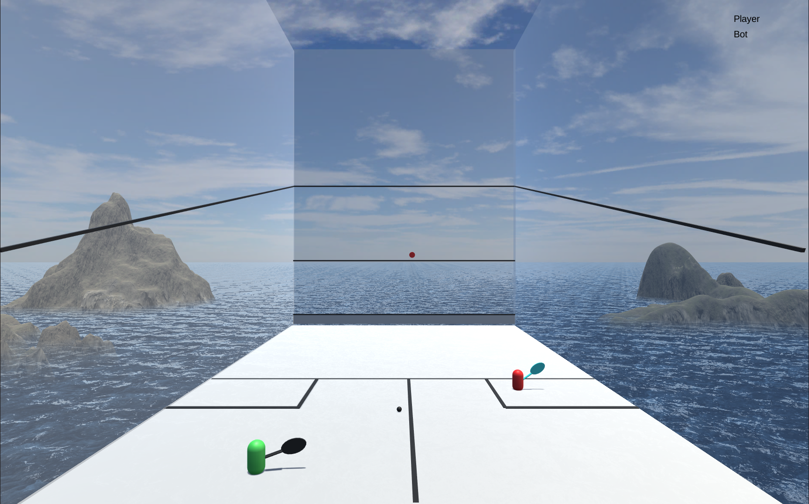

<!DOCTYPE html>
<html>

   <body>

     <a href="https://simmer.io/@peilunnn/squashawash" target="_blank">
      
  </a>
   </body>
</html>

  <!-- TITLE -->

  <h1 align="center"> :ocean: SquashAwash :ocean:</a></h1>
  

    A 3D Squash video game against a bot. Written in C# and rendered in Unity. 
     
     
    <a href="https://github.com/peilunnn/SquashAwash/tree/master/Assets/scripts">Source Code</a>
    ·
    <a href="https://github.com/peilunnn/SquashAwash/issues">Report Bug</a>
    ·
  

  

<!-- TABLE OF CONTENTS -->

## Table of Contents :notebook_with_decorative_cover:

* [About the Project :eyes:](#about-the-project)
* [Social Media :fire:](#contact)
   

## About The Project :eyes:

**Player movement:** WASD or arrow keys
 
 
**Serving:** hold J and move the red target using WASD or arrow keys, then release to do a lob serve OR hold K and move the red target using WASD or arrow keys, then release to do a hard serve.
 
 
**While ball is in play:** hold H and move the red target using WASD or arrow keys
 
 
**If you lose the rally:** you will have 2 to 6 seconds before the bot will serve
  

Play it here: https://simmer.io/@peilunnn/squashawash
   

## Social Media :fire:

🥂**Pei Lun** 

🔗 [LinkedIn](https://www.linkedin.com/in/pei-lun-tan/)

📧 [Email](mailto:peilunnn@gmail.com)
